<!--
class: title
-->
# Architectures

---

# Flux

---
<!--
class: noclass
_footer: 参考：https://facebook.github.io/flux/
-->

# Flux

FluxはMVCへの批判から生まれた
「MVCは機能を追加しようとするたびに肥大化して壊れやすくなる」
→ Model とViewの間でデータフローが入り乱れていると考えられた

---
<!--
class: main
_footer: 参考：https://github.com/facebook/flux/tree/master/examples/flux-concepts
-->

# Flux

---
# Flux

* メリット
  * どこに何を書けば良いのかが明確
  * データの流れがわかりやすいので、デバッグしやすい
  * Viewから状態管理を消すこともできる
  * スケーラビリティが高い
* デメリット
  * 記述が冗長になりがち
  * 規模の大きなアプリケーションだと、Actionが肥大化する

---
<!--
class: title
-->
# Redux

---
<!--
class: noclass
_footer: 参考：https://redux.js.org/understanding/history-and-design/prior-art
-->

# Reduxとは

* FluxとElm(関数型言語)の影響を強く受けたアーキテクチャ。
* 変化と非同期性を解決するために提唱された。

→ 更新がどのタイミングで起きるのかを明確にし、整合性の取れた状態管理を実現する

---
<!--
class: main
_footer: https://app.diagrams.net/#G1HIdCatMpOyTdhuQAyEpp_Ltx4wdcPIMb
-->
# Redux

---

# Reduxのコンセプト

* Single source of truth
  * アプリ全体を単一のStateで管理する
* State is read-only
  * Reducerが新しいStateを生成するまで、現在のStateは変更されない
* Changes are made with pure functions
  * Reducerが純粋関数である

---

# Redux

* メリット
  * （Fluxと同じく、）双方向のデータフローと比較してシンプル
  * ViewとReduxのレイヤーがそれぞれ独立して存在している（互いに関知しない）
* デメリット
  * 関数の再利用性の低下

---
<!--
class: title
-->

# React Hooks

---
<!--
class: noclass
-->

# React Hooks とは

関数コンポーネントにReactの機能（ローカルステート、ライフサイクルメソッドなど）を利用可能にしたもの。

---
<!--
_footer: 参考：https://ja.reactjs.org/docs/hooks-intro.html
-->

# React Hooksの特徴
* Classを利用せずにState Fullなロジックを記述できる
  * 責務（関心）を分離することができるようになった
  * 純粋関数はView(UI)
  * Hooksは状態、ロジック、ライフサイクル（※副作用)

→ 結果的にテストがしやすくなった

※副作用：引数から戻り値を求めること以外の仕事（変数の変更や外部入出力）

---
<!--
class: noclass
-->

# React Hooksで何を実現したいのか

* 凝集度をあげたい
  * 機能的に関係のあるもので関数をまとめたい
* UIコンポーネントを純粋関数にしたい
