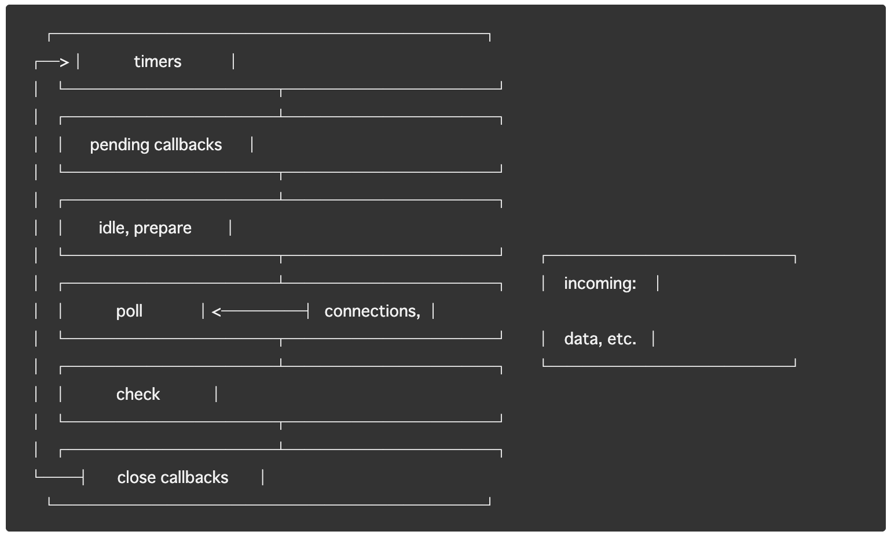

# NodeJS

<!--
class: title
-->

---
# NodeJSとは何か

JavaScriptが(C++と同様に)ファイル操作などマシンに近い処理を実施することができる、V8(ECMA Script)を利用できるようにした**JavaScriptの実行環境**
<!--
class: noclass
_footer: 参考：https://www.udemy.com/course/understand-nodejs/ \n 　　　https://nodejs.org/ja/about/
-->

---

# 言語の抽象度

* Javascript（ブラウザ）
* C/C++, PHP, Python (PC) <- Node.JS
* Assembly Language
* Macine Language

→ node index.jsを実行したまま変更が即時反映しないのは、V8で変換されている部分(->Macine Language)が再実行されないから。

<!--
_footer: 参考：
-->

---
# NodeJSの特徴

* **Non-blocking I/O**
  * Event Loop
  * Single Thread

**→大量の同時接続をさばけるネットワークアプリケーションの構築がしたい**

<!--
class: noclass
_footer: 参考：https://nodejs.org/en/docs/guides/
-->

---

# コラム：C10K問題

apache-> nginxの時代から騒がれていた問題。

> ハードウェアの性能上は問題がなくても、クライアント数があまりにも多くなるとサーバがパンクする問題のこと。
C は「Client（クライアント）」の頭文字、10K は「1 万台」を意味する。
「クライアント 1 万台問題」ともいわれる。


<!--
_footer: 参考：https://d.hatena.ne.jp/keyword/C10K%20%E5%95%8F%E9%A1%8C
-->

---

# コラム：apache と nginx

## apache: マルチスレッド・マルチプロセス

リクエストに応じてスレッド/プロセスを立ち上げる仕組み。
スレッド/プロセスが増えるほどメモリ使用率が上昇するため、**コンテキストスイッチ**が多く発生し、**C10K問題**が発生する。

## nginx: イベント駆動

イベントが発生するまで待機し、発生したイベントの種類に応じて実行される。

<!--
class: noclass
_footer: 参考：https://qiita.com/i-tanaka730/items/79e8e2c3ceb2bde51436 \n　　　https://blog.mosuke.tech/entry/2016/06/04/180122/
-->

---

# コラム：コンテキストスイッチ

> コンテキストスイッチとは、コンピュータの処理装置（CPU）が現在実行している処理の流れ（プロセス、スレッド）を一時停止し、別のものに切り替えて実行を再開すること。


<!--
_footer: 参考：http://e-words.jp/w/%E3%82%B3%E3%83%B3%E3%83%86%E3%82%AD%E3%82%B9%E3%83%88%E3%82%B9%E3%82%A4%E3%83%83%E3%83%81.html
-->

---
# Non-blocking I/Oとは

非同期処理のなかでもI/OなどJS以外の操作も非同期で動作すること

(Non Blocking I/O ⊂ 非同期処理)


> I/O: システムのディスクやネットワークとのやり取り
> blocking： NodeJSプロセス内で実行されたJavaScriptが、JavaScript以外の操作が完了するまで待たなければならない状態のこと

**→ NodeJSは標準で非同期（Non-blocking）なメソッドを提供している。**

<!--
_footer: 参考：https://nodejs.org/en/docs/guides/blocking-vs-non-blocking/
-->

---
# 同期・非同期処理について

同期

```javascript
const fs = require('fs');
const data = fs.readFileSync('/file.md'); // ファイルが読み込まれるまでここでブロック
console.log(data);
moreWork(); // console.log の後に実行されます
```

非同期

```javascript
const fs = require('fs');
fs.readFile('/file.md', (err, data) => {
  if (err) throw err;
  console.log(data);
});
moreWork(); // console.log の前に実行されます
```

<!--
_footer: 参考：https://nodejs.org/en/docs/guides/blocking-vs-non-blocking/
-->

---
# コラム：Non-blocking I/OとNodeJS

Non-blocking I/Oを利用しているものは複数ある。
> Python: Twisted
> Ruby: EventMachine
> Perl: ColoのAnyEvent

だが、どれもNon-BlockingのI/Oを強制していないため、スレッドで書かれた同様の処理をするプログラムよりも遅い場合がある。

**-> NodeJSはNon-Blocking I/O の使用を強制する**

<!--
_footer: 参考：https://badatmath.hatenablog.com/entry/20101020/1287587240
-->

---

# NodeJSはクライアントサイドでは利用されないのか

NodeJSの**コアの機能**はサーバーサイドで利用される。だが、あくまでNodeJSはJavascriptをブラウザ上だけでなくOSのシステムに関与可能にするための**実行環境**を指しているため、クライアントサイドでもNodeJS自体は利用される。

例：NodeJSを利用しているもの
1. Babel: ES6以降のコードをES5に変換する際に利用される
2. Jest: テストツール
3. ESLint: コード検証ツール
4. Gatsby: 静的サイトのビルド

<!--
_footer: 参考：https://qiita.com/non_cal/items/a8fee0b7ad96e67713eb
-->

---
---

---
# Event Loop



<!--
class: noclass
_footer: 参考：https://nodejs.org/en/docs/guides/event-loop-timers-and-nexttick/
-->

---

# Event Loop

* timers: setTimeout()やsetInterval()でスケジュールされたcallbacksを実行する
* pending callbacks: 次のループに置かれた I/O callbacks を実行する
* idle, prepare: 内部利用
* poll: 新しい I/O イベントの取得。 I/O 関係のcallbackを実行 (close callbacksの例外の大半、timersやsetImmediate()にスケジュールされたもの)。 適切な場合、nodeはここでロックする。
* check: setImmediate() callbacks がここで呼ばれる。
* close callbacks: close callbacksの何かしら。 例） socket.on('close', ...).

<!--
_footer: 参考：https://nodejs.org/en/docs/guides/event-loop-timers-and-nexttick/
-->

---
# timers

```JavaScript
const fs = require('fs');
function someAsyncOperation(callback) {
  fs.readFile('/path/to/file', callback); // Assume this takes 95ms to complete
}
const timeoutScheduled = Date.now();
setTimeout(() => {
  const delay = Date.now() - timeoutScheduled;
  console.log(`${delay}ms have passed since I was scheduled`);
}, 100);

someAsyncOperation(() => { // do someAsyncOperation which takes 95 ms to complete
  const startCallback = Date.now();
  while (Date.now() - startCallback < 10) { // do something that will take 10ms...
  }
});
```
---
